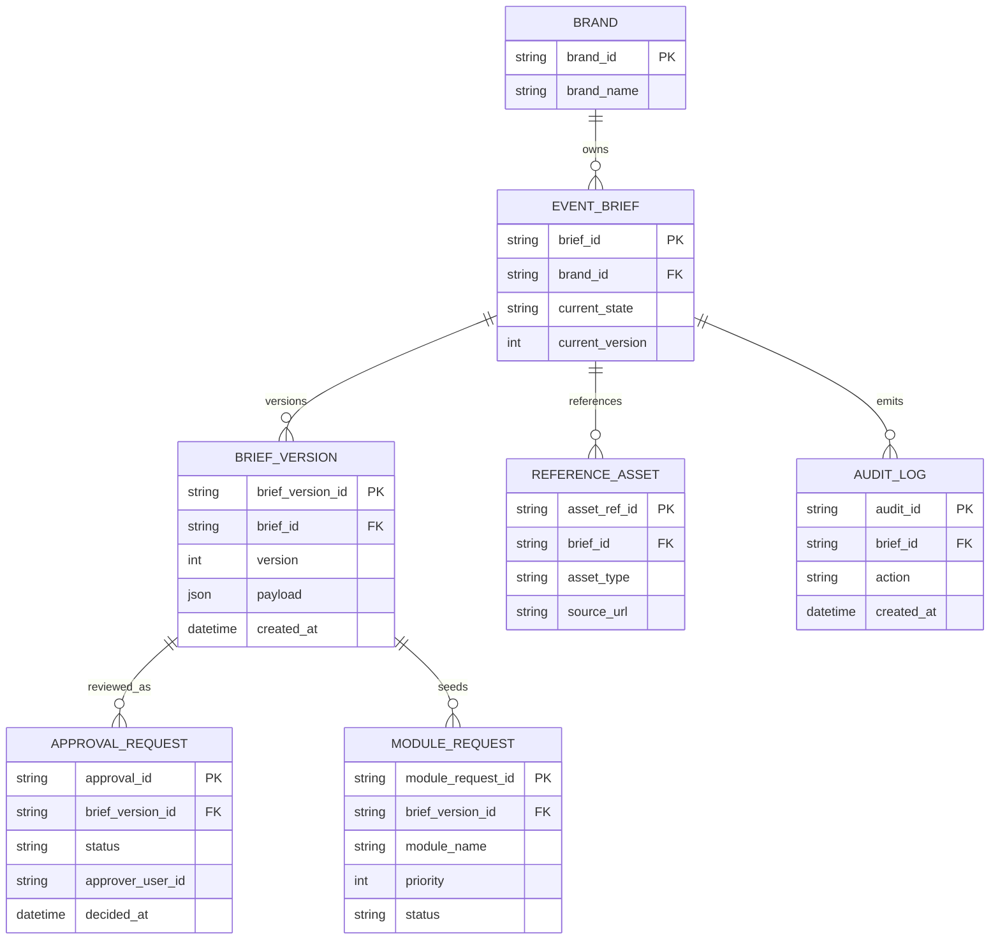
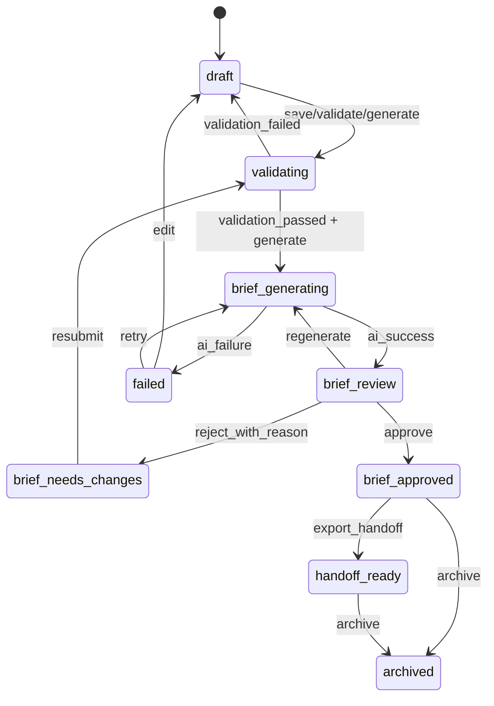
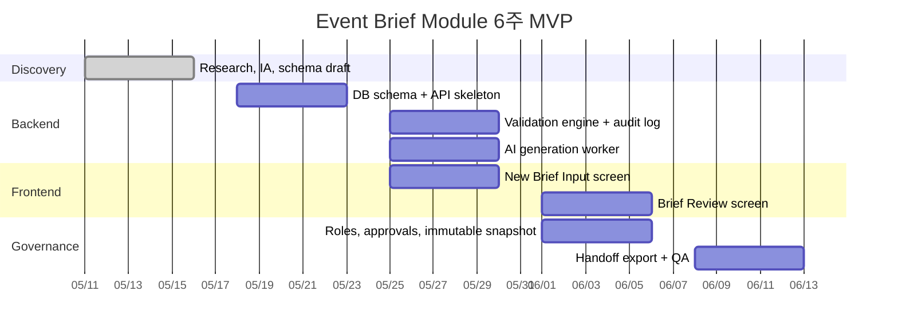

# 프로덕션 준비형 이벤트 브리프 모듈 설계 보고서

## 핵심 요약

이벤트 브리프 모듈의 역할은 “예쁜 기획 문서”를 만드는 것이 아니라, 이후의 인스타그램·블로그·디자인·승인·자산 모듈이 공통으로 참조하는 **단일 원본 데이터**를 만드는 데 있다. 공개 사례를 비교하면 공통 분모가 명확하다. structured/modular content를 통해 재사용 가능한 콘텐츠 단위를 먼저 정의하고, 승인 워크플로우를 통해 게시 전 검토를 강제하며, 승인된 자산을 중앙에서 관리하고, 디자인 시스템 토큰/컴포넌트를 통해 다운스트림 제작을 일관되게 이어 붙인다. 따라서 1단계의 정답은 자유 텍스트 중심 문서가 아니라 **구조화된 JSON 스키마, 승인 상태, 자산 참조, 감사 로그, 불변 승인 스냅샷**을 가진 모듈이다. citeturn24view2turn24view1turn14view2turn12search0turn23view0turn14view8

AI의 책임과 규칙 코드의 책임도 초기에 분리해야 한다. entity["company","Anthropic","ai company"]은 실무적으로 성공한 에이전트 시스템이 복잡한 프레임워크보다 **단순하고 조합 가능한 워크플로**를 사용했다고 설명하며, 워크플로와 에이전트를 구조적으로 구분한다. 이 원칙을 적용하면 브리프 모듈에서는 AI가 요약·정규화·추천을 맡고, 상태 전이·권한·검증·감사 로그·불변성은 deterministic code가 맡는 구조가 가장 안정적이다. citeturn19view0turn19view2turn28search1turn28search6turn28search17

특히 이미지 자동화와 디자인 자동화를 1단계에서 함께 넣지 않는 것이 중요하다. entity["company","Midjourney","image generation service"]는 공식 가이드라인에서 “일부 드문 예외를 제외하면 API를 제공하지 않으며, 서드파티 앱/스크립트와 자동화된 상호작용을 금지한다”고 명시한다. 또한 entity["company","Figma","design software"] 플러그인은 사용자에 의해 실행되는 짧은 액션 단위이며 백그라운드 실행이 불가능하다. 따라서 1단계 MVP에서는 Midjourney와 Figma를 직접 오케스트레이션하지 말고, **브리프 입력 → AI 정규화 → 검토 → 승인 → 핸드오프 패키지 생성**까지를 확실하게 끝내는 것이 프로덕션 준비 측면에서 더 안전하다. citeturn13view0turn13view3turn13view4turn13view2

기술적으로는 웹 애플리케이션 형태의 구현이 장기적으로 가장 적합하다. entity["company","Supabase","backend platform"]는 Postgres 기반 데이터베이스, 스토리지, 세분화된 접근 제어와 RLS를 제공하고, private bucket과 API 기반 스토리지 접근을 권장한다. Next.js App Router는 서버/클라이언트 구성과 라우트 핸들러, 배포 유연성을 제공한다. 반면 no-code 조합은 프로세스 검증에는 유리하지만, 승인 스냅샷의 불변성·정교한 권한 분리·후속 모듈 연계까지 고려하면 별도 웹 애플리케이션이 더 적합하다. citeturn21view6turn21view7turn21view0turn21view2turn21view5

## 벤치마크와 설계 원칙

아래 비교표는 1단계 이벤트 브리프 모듈을 설계할 때 참고할 수 있는 공개·공식 사례를 요약한 것이다. 우선순위는 공식 문서와 공식 제품/헬프센터 자료에 두었다. 각 사례는 서로 다른 문제를 푼다. Contentful은 “콘텐츠 구조화”, Adobe는 “콘텐츠 공급망과 승인”, Canva는 “게시 전 승인”, Bynder는 “중앙 자산 관리와 자동 변환”, Figma는 “디자인 시스템과 하위 제작 일관성”에 강하다. citeturn24view2turn14view2turn12search0turn23view0turn14view8

| 비교 대상 | 공식 접근 요약 | 브리프 모듈에 주는 시사점 | 공식 자료 |
|---|---|---|---|
| entity["company","Contentful","cms platform"] | Content model은 콘텐츠 구조와 조직을 정의하며, 일관성·재사용성·효율적 관리를 보장한다. Modular content는 콘텐츠를 헤더, 본문, 이미지, CTA 같은 부품으로 쪼개 재조합하게 한다. API-first 전달은 여러 채널로의 확장을 전제로 한다. | 브리프는 “문서”가 아니라 “콘텐츠 타입”이어야 한다. 채널용 출력물은 브리프를 조합해 만든 파생물이어야 한다. | citeturn24view2turn24view0turn24view1turn24view3 |
| entity["company","Adobe","software company"] | Content supply chain을 계획·생성·관리·전달·측정의 end-to-end 프로세스로 정의한다. GenStudio는 human and agent workflows, metadata foundation, built-in approval workflows를 강조한다. Workfront는 multi-stage review, dependencies, audit trail을 지원한다. | 브리프 모듈은 전략 입력과 제작 모듈 사이의 **메타데이터 기반 계획 계층**이어야 한다. 승인 이전에는 downstream 실행이 시작되면 안 된다. | citeturn14view2turn25view0turn25view4turn25view2 |
| entity["company","Canva","design platform"] | Enterprise/Teams 문서에서 디자인이 publish/share 되기 전에 approval을 요구하도록 설정할 수 있고, Request approval 시 reviewer, due date, note를 지정할 수 있다. Brand controls는 승인된 색상·폰트와 게시 전 승인 요구를 걸 수 있다. | 브리프도 “저장”과 “승인”을 분리해야 하며, reviewer·due date·reason이 관리돼야 한다. 승인되지 않은 brief는 downstream 모듈에 전달되면 안 된다. | citeturn12search0turn12search6turn12search3turn12search10turn12search11 |
| entity["company","Bynder","dam platform"] | DAM은 이미지·비디오·문서·브랜드 자산을 중앙에서 저장·조직·검색·공유하는 single source of truth로 정의된다. DAT는 자산 최적화를 자동화하고, predictable URLs와 permissions를 제공한다. Golfbreaks 사례에서는 taxonomy와 DAT로 제작 속도가 크게 개선됐다. | 브리프는 자산 파일 자체를 들고 있어야 하는 것이 아니라, **승인된 자산에 대한 참조와 메타데이터**를 들고 있어야 한다. 나중의 채널 변환은 브리프와 자산 참조를 합쳐야 한다. | citeturn23view0turn23view4turn14view7turn23view2turn23view1 |
| entity["company","Figma","design software"] | Design systems page와 Help Center는 styles, variables, components, team libraries, variable modes를 통해 승인된 디자인 요소를 팀 전체에서 재사용하도록 권장한다. Published library는 팀 일관성을 보장한다. | 브리프 모듈은 아직 디자인을 만들지 않더라도, 후속 제작이 소비할 수 있는 **토큰화된 크리에이티브 지시문**을 만들어야 한다. | citeturn14view8turn14view9turn8search1turn8search5 |

이 사례들을 종합하면 브리프 모듈의 설계 원칙은 다섯 가지로 압축된다. 첫째, 페이지 중심이 아니라 **구조화된 콘텐츠 중심**이어야 한다. 둘째, 초안과 승인본을 구분하는 **승인 게이트**가 있어야 한다. 셋째, 이미지와 문서를 직접 품는 대신 **자산 참조와 메타데이터**를 보관해야 한다. 넷째, 후속 디자인 시스템과 연결되도록 **톤·금지어·텍스트 안전영역·비율 선호도** 같은 하위 제작 친화 필드를 가져야 한다. 다섯째, AI는 추천을 하되 최종 워크플로는 **코드로 고정된 상태기계**가 통제해야 한다. 이 방향은 Anthropic이 말하는 workflow-first 접근과도 일치한다. citeturn19view0turn24view2turn14view2turn23view0turn14view8

Midjourney와 Figma는 이 원칙의 예외가 아니라 제약 조건이다. Midjourney는 승인되지 않은 자동화 통합이 정책상 어려워, 1단계 브리프 모듈에서 호출 대상이 아니라 **후속 수동/정책 준수형 핸드오프 대상**으로 취급해야 한다. Figma는 REST API로 읽기/추출이 가능하지만, 플러그인은 사용자 액션 기반이고 백그라운드 작동이 불가하므로 1단계에서 “비동기 서버가 자동으로 Figma를 편집한다”는 가정은 피해야 한다. citeturn13view0turn13view4turn13view3

## 데이터 모델과 JSON 스키마

브리프 스키마는 downstream 모듈이 읽을 수 있는 “기준 데이터 계약”이어야 한다. Contentful이 말하는 content model과 modular content 관점에서 보면, 이벤트명·목표·타깃·CTA 같은 항목은 자유 문장으로 흩어져 저장되면 안 되고, 재사용 가능한 필드와 참조로 나뉘어야 한다. Adobe가 강조하는 metadata foundation과 Bynder의 중앙 자산 관리 원칙을 합치면, 브리프는 텍스트와 상태뿐 아니라 자산 참조·거버넌스·승인 맥락까지 함께 담아야 한다. citeturn24view2turn24view0turn14view2turn23view0

### 필드 선택 비교

| 필드군 | 최소 실험용 | 권장 prod v1 | Phase 2+ 확장 |
|---|---|---|---|
| 식별자 | `brief_id`, `brand_name`, `event_name` | `brief_id`, `schema_version`, `brand_id`, `event.slug`, `version` | 외부 시스템 키, 캠페인/상품 FK |
| 전략 | `event_type`, `objective`, `channels` | `event.type`, `event.objectives[]`, `audience[]`, `schedule.*` | 시장/언어별 variation, KPI target |
| 메시징 | `key_message`, `cta`, `offer` | `key_message`, `supporting_points[]`, `cta.action_type`, `cta.label`, `cta.url`, `mandatory_copy[]`, `forbidden_words[]` | 채널별 tone override, legal copy block |
| 크리에이티브 | `visual_keywords[]` | `visual_keywords[]`, `style_reference_urls[]`, `image_text_safety`, `primary_ratio_preferences[]`, `do_not_use_visuals[]` | 채널별 템플릿 슬롯 매핑, shot list |
| 자산 | 없음 또는 URL 1개 | `reference_asset_urls[]`, `uploaded_asset_ids[]`, `required_asset_types[]` | `selected_primary_visual_asset_id`, 후보군/선정 이력 |
| 거버넌스 | `owner_user_id` | `owner_user_id`, `approver_user_ids[]`, `legal_review_required`, `risk_level` | 부서별 다단계 승인 규칙 |
| AI 산출 | 없음 | `derived.normalized_summary`, `derived.module_recommendations[]`, `derived.risk_flags[]` | prompt lineage, model provenance |
| 시스템 | `status` | `system.lifecycle_state`, `created_at`, `updated_at`, `approved_at` | publish jobs, performance linkages |

위 표의 핵심은 **입력 필드와 AI 파생 필드를 분리**하는 것이다. 사용자 입력은 source of truth이고, AI가 생성한 요약·리스크·모듈 추천은 `derived.*`로 분리해야 한다. 그래야 리뷰 화면에서 “원본 입력”과 “AI 정규화 결과”를 비교하고 승인할 수 있다. 이 구분은 review/approval가 생산성과 통제를 동시에 보장해야 한다는 Adobe와 Canva의 모델에 잘 맞는다. citeturn25view2turn25view4turn12search0turn12search6

### 상세 필드 정의

#### 식별 및 운영 메타데이터

| 필드 경로 | 타입 | 필수 | 예시 | 설계 이유 |
|---|---|---:|---|---|
| `schema_version` | string | Y | `1.0.0` | 스키마 진화·마이그레이션 관리 |
| `brief_id` | string | Y | `brf_01JTFCZ6Y3VZ3Q8K1A2M9M9J4N` | 외부 모듈과의 안정적 참조 |
| `source.created_by` | string | Y | `usr_mkt_01` | 작성자 책임 추적 |
| `source.created_via` | enum(`ui`,`api`,`import`) | Y | `ui` | 유입 경로 분석 |
| `source.locale` | string | Y | `ko-KR` | 언어/카피 규칙 분기 |
| `source.timezone` | string | Y | `Asia/Seoul` | 일정 계산과 승인 SLA 일관화 |
| `brand.brand_id` | string | Y | `brand_olive_test` | 브랜드 가이드 FK |
| `brand.brand_name` | string | Y | `Test Beauty Major` | 운영자 가독성 |
| `brand.brand_guideline_ref` | string | N | `brandguides/test-beauty-major.md` | 브랜드 규칙 참조 |

#### 전략, 타깃, 채널

| 필드 경로 | 타입 | 필수 | 예시 | 설계 이유 |
|---|---|---:|---|---|
| `event.name` | string | Y | `5월 수분 진정 프로모션` | 캠페인 표시명 |
| `event.slug` | string | Y | `may-hydration-calm-promo` | 파일명·URL·API key 정규화 |
| `event.type` | enum | Y | `promotion` | 조건부 규칙 분기 |
| `event.objectives[]` | string[] | Y | `["conversion","awareness"]` | 채널별 출력 우선순위 결정 |
| `audience[].segment_name` | string | Y | `민감성 피부 20-34 여성` | 타깃 요약 |
| `audience[].interests[]` | string[] | N | `["스킨케어","성분"]` | 카피/비주얼 힌트 |
| `audience[].pain_points[]` | string[] | N | `["홍조","건조"]` | 문제-해결 메시지 도출 |
| `channels[]` | enum[] | Y | `["instagram_carousel","naver_blog_thumbnail"]` | downstream 모듈 범위 확정 |
| `requested_modules[]` | enum[] | N | `["instagram_carousel","naver_blog_inline"]` | 사용자가 원하는 산출물 명시 |

#### 메시징

| 필드 경로 | 타입 | 필수 | 예시 | 설계 이유 |
|---|---|---:|---|---|
| `messaging.key_message` | string | Y | `민감한 피부도 편안하게, 7일 수분 진정 루틴` | 핵심 문장 원본 |
| `messaging.supporting_points[]` | string[] | N | `["저자극 포뮬러","보습 성분 강화"]` | 카드뉴스·블로그 확장용 |
| `messaging.offer` | string | 조건부 | `세트 구매 20% 할인` | 프로모션형 이벤트 조건부 필수 |
| `messaging.cta.action_type` | enum | Y | `link` | CTA 처리 방식 고정 |
| `messaging.cta.label` | string | Y | `프로모션 보기` | 버튼/링크 텍스트 |
| `messaging.cta.url` | string | 조건부 | `https://example.com/promo/may-hydration` | 링크형 CTA만 필수 |
| `messaging.tone_keywords[]` | string[] | Y | `["신뢰감","담백함","전문성"]` | AI/디자인 톤 가이드 |
| `messaging.forbidden_words[]` | string[] | N | `["충격가","역대급"]` | 브랜드 컴플라이언스 |
| `messaging.mandatory_copy[]` | string[] | N | `["행사 기간 한정","자세한 사항은 페이지 참고"]` | 필수 표기 강제 |

#### 크리에이티브와 자산 참조

| 필드 경로 | 타입 | 필수 | 예시 | 설계 이유 |
|---|---|---:|---|---|
| `creative_direction.visual_keywords[]` | string[] | Y | `["수분감","차분한 블루","클린"]` | 이미지/레이아웃 방향성 |
| `creative_direction.style_reference_urls[]` | url[] | N | `["https://example.com/ref/1"]` | 레퍼런스 연결 |
| `creative_direction.do_not_use_visuals[]` | string[] | N | `["과도한 입자효과","형광톤"]` | 금지 시각 요소 |
| `creative_direction.image_text_safety` | enum(`wide`,`medium`,`tight`) | Y | `wide` | 텍스트 오버레이 안전영역 |
| `creative_direction.primary_ratio_preferences[]` | string[] | N | `["1:1","4:5","16:9"]` | 후속 채널 파생 기준 |
| `assets.reference_asset_urls[]` | url[] | N | `["https://example.com/assets/product-shot.png"]` | 외부 자산 참조 |
| `assets.uploaded_asset_ids[]` | string[] | N | `["ast_001"]` | 내부 업로드 자산 참조 |
| `assets.required_asset_types[]` | enum[] | N | `["product_packshot","texture","logo"]` | 후속 제작 체크리스트 |
| `assets.selected_primary_visual_asset_id` | string/null | N | `null` | 2단계 이후 이미지 선정 연결점 |

#### 거버넌스, AI 파생 결과, 시스템

| 필드 경로 | 타입 | 필수 | 예시 | 설계 이유 |
|---|---|---:|---|---|
| `governance.owner_user_id` | string | Y | `usr_mkt_01` | 실무 책임자 |
| `governance.approver_user_ids[]` | string[] | Y | `["usr_brand_01"]` | 승인자 지정 |
| `governance.legal_review_required` | boolean | Y | `false` | 규제 검토 분기 |
| `governance.compliance_notes` | string | N | `의약적 표현 금지` | 승인 시 참고 |
| `governance.risk_level` | enum(`low`,`medium`,`high`) | Y | `low` | SLA/승인 난이도 |
| `derived.normalized_summary` | string | N | `이 이벤트는 ...` | AI 정규화 출력 |
| `derived.module_recommendations[]` | object[] | N | `[{module_name:"instagram_carousel",priority:1}]` | 다음 모듈 추천 |
| `derived.risk_flags[]` | object[] | N | `[{code:"MISSING_OFFER",severity:"medium"}]` | 리뷰 포인트 가시화 |
| `system.lifecycle_state` | enum | Y | `draft` | 상태기계 기준 |
| `system.version` | integer | Y | `1` | 재생성/수정 버전 관리 |
| `system.created_at` | datetime | Y | `2026-05-05T11:20:00+09:00` | 생성 시점 |
| `system.updated_at` | datetime | Y | `2026-05-05T11:20:00+09:00` | 마지막 변경 |
| `system.approved_at` | datetime/null | N | `null` | 승인 스냅샷 생성 시점 |

### 권장 JSON Schema

아래 스키마는 1단계 이벤트 브리프 모듈에 바로 적용할 수 있는 **machine-usable baseline**이다. Contentful의 content model/validation 사고방식과 Adobe/Canva의 승인 전 검토 관점을 반영해, 입력·파생·시스템 필드를 구분했다. 필드별 조건부 검증은 JSON Schema와 앱 레이어 검증을 함께 쓰는 것이 현실적이다. citeturn24view3turn14view1turn25view0

```json
{
  "$schema": "https://json-schema.org/draft/2020-12/schema",
  "$id": "https://example.com/schemas/event-brief.schema.json",
  "title": "EventBrief",
  "type": "object",
  "additionalProperties": false,
  "required": [
    "schema_version",
    "brief_id",
    "source",
    "brand",
    "event",
    "audience",
    "channels",
    "schedule",
    "messaging",
    "creative_direction",
    "governance",
    "system"
  ],
  "$defs": {
    "nonEmptyString": {
      "type": "string",
      "minLength": 1
    },
    "httpsUrl": {
      "type": "string",
      "format": "uri",
      "pattern": "^https://"
    },
    "channel": {
      "type": "string",
      "enum": [
        "instagram_feed",
        "instagram_carousel",
        "instagram_story",
        "threads",
        "x_post_visual",
        "naver_blog_thumbnail",
        "naver_blog_inline",
        "brunch_cover",
        "community_banner"
      ]
    },
    "module": {
      "type": "string",
      "enum": [
        "instagram_feed",
        "instagram_carousel",
        "instagram_story",
        "threads",
        "x_post_visual",
        "naver_blog_thumbnail",
        "naver_blog_inline",
        "brunch_cover",
        "community_banner"
      ]
    },
    "eventType": {
      "type": "string",
      "enum": [
        "promotion",
        "launch",
        "seasonal",
        "community",
        "editorial",
        "announcement",
        "other"
      ]
    },
    "objective": {
      "type": "string",
      "enum": [
        "awareness",
        "conversion",
        "engagement",
        "traffic",
        "retention",
        "education",
        "lead_generation"
      ]
    },
    "riskLevel": {
      "type": "string",
      "enum": ["low", "medium", "high"]
    },
    "lifecycleState": {
      "type": "string",
      "enum": [
        "draft",
        "validating",
        "brief_generating",
        "brief_review",
        "brief_needs_changes",
        "brief_approved",
        "handoff_ready",
        "failed",
        "archived"
      ]
    }
  },
  "properties": {
    "schema_version": {
      "type": "string",
      "const": "1.0.0"
    },
    "brief_id": {
      "type": "string",
      "pattern": "^brf_[A-Za-z0-9_-]{8,64}$"
    },
    "source": {
      "type": "object",
      "additionalProperties": false,
      "required": ["created_by", "created_via", "locale", "timezone"],
      "properties": {
        "created_by": { "$ref": "#/$defs/nonEmptyString" },
        "created_via": {
          "type": "string",
          "enum": ["ui", "api", "import"]
        },
        "locale": { "type": "string", "examples": ["ko-KR"] },
        "timezone": { "type": "string", "examples": ["Asia/Seoul"] }
      }
    },
    "brand": {
      "type": "object",
      "additionalProperties": false,
      "required": ["brand_id", "brand_name"],
      "properties": {
        "brand_id": { "$ref": "#/$defs/nonEmptyString" },
        "brand_name": { "$ref": "#/$defs/nonEmptyString" },
        "brand_guideline_ref": { "type": "string" },
        "market": { "type": "string" },
        "product_line": { "type": "string" }
      }
    },
    "event": {
      "type": "object",
      "additionalProperties": false,
      "required": ["name", "slug", "type", "objectives"],
      "properties": {
        "name": { "$ref": "#/$defs/nonEmptyString" },
        "slug": {
          "type": "string",
          "pattern": "^[a-z0-9]+(?:-[a-z0-9]+)*$"
        },
        "type": { "$ref": "#/$defs/eventType" },
        "objectives": {
          "type": "array",
          "items": { "$ref": "#/$defs/objective" },
          "minItems": 1,
          "uniqueItems": true
        }
      }
    },
    "audience": {
      "type": "array",
      "minItems": 1,
      "items": {
        "type": "object",
        "additionalProperties": false,
        "required": ["segment_name"],
        "properties": {
          "segment_name": { "$ref": "#/$defs/nonEmptyString" },
          "interests": {
            "type": "array",
            "items": { "type": "string" },
            "uniqueItems": true
          },
          "pain_points": {
            "type": "array",
            "items": { "type": "string" },
            "uniqueItems": true
          },
          "region": { "type": "string" }
        }
      }
    },
    "channels": {
      "type": "array",
      "items": { "$ref": "#/$defs/channel" },
      "minItems": 1,
      "uniqueItems": true
    },
    "requested_modules": {
      "type": "array",
      "items": { "$ref": "#/$defs/module" },
      "uniqueItems": true
    },
    "schedule": {
      "type": "object",
      "additionalProperties": false,
      "required": [
        "campaign_start_at",
        "campaign_end_at",
        "review_due_at",
        "publish_deadline_at",
        "timezone"
      ],
      "properties": {
        "campaign_start_at": {
          "type": "string",
          "format": "date-time"
        },
        "campaign_end_at": {
          "type": "string",
          "format": "date-time"
        },
        "review_due_at": {
          "type": "string",
          "format": "date-time"
        },
        "publish_deadline_at": {
          "type": "string",
          "format": "date-time"
        },
        "timezone": { "type": "string" }
      }
    },
    "messaging": {
      "type": "object",
      "additionalProperties": false,
      "required": ["key_message", "cta", "tone_keywords"],
      "properties": {
        "key_message": {
          "type": "string",
          "minLength": 5,
          "maxLength": 200
        },
        "supporting_points": {
          "type": "array",
          "items": { "type": "string", "maxLength": 120 },
          "maxItems": 5
        },
        "offer": {
          "type": "string",
          "maxLength": 160
        },
        "cta": {
          "type": "object",
          "additionalProperties": false,
          "required": ["action_type", "label"],
          "properties": {
            "action_type": {
              "type": "string",
              "enum": ["link", "comment", "visit_store", "apply", "download", "none"]
            },
            "label": {
              "type": "string",
              "minLength": 1,
              "maxLength": 40
            },
            "url": {
              "$ref": "#/$defs/httpsUrl"
            }
          }
        },
        "tone_keywords": {
          "type": "array",
          "items": { "type": "string" },
          "minItems": 1,
          "maxItems": 8,
          "uniqueItems": true
        },
        "forbidden_words": {
          "type": "array",
          "items": { "type": "string" },
          "uniqueItems": true
        },
        "mandatory_copy": {
          "type": "array",
          "items": { "type": "string", "maxLength": 140 },
          "uniqueItems": true
        }
      }
    },
    "creative_direction": {
      "type": "object",
      "additionalProperties": false,
      "required": ["visual_keywords", "image_text_safety"],
      "properties": {
        "visual_keywords": {
          "type": "array",
          "items": { "type": "string" },
          "minItems": 1,
          "maxItems": 12,
          "uniqueItems": true
        },
        "style_reference_urls": {
          "type": "array",
          "items": { "$ref": "#/$defs/httpsUrl" },
          "maxItems": 10
        },
        "do_not_use_visuals": {
          "type": "array",
          "items": { "type": "string" },
          "uniqueItems": true
        },
        "image_text_safety": {
          "type": "string",
          "enum": ["wide", "medium", "tight"]
        },
        "primary_ratio_preferences": {
          "type": "array",
          "items": { "type": "string" },
          "uniqueItems": true
        }
      }
    },
    "assets": {
      "type": "object",
      "additionalProperties": false,
      "properties": {
        "reference_asset_urls": {
          "type": "array",
          "items": { "$ref": "#/$defs/httpsUrl" }
        },
        "uploaded_asset_ids": {
          "type": "array",
          "items": { "type": "string" },
          "uniqueItems": true
        },
        "required_asset_types": {
          "type": "array",
          "items": {
            "type": "string",
            "enum": [
              "product_packshot",
              "logo",
              "texture",
              "mood_image",
              "campaign_photo",
              "legal_badge"
            ]
          },
          "uniqueItems": true
        },
        "selected_primary_visual_asset_id": {
          "type": ["string", "null"]
        }
      }
    },
    "governance": {
      "type": "object",
      "additionalProperties": false,
      "required": [
        "owner_user_id",
        "approver_user_ids",
        "legal_review_required",
        "risk_level"
      ],
      "properties": {
        "owner_user_id": { "$ref": "#/$defs/nonEmptyString" },
        "approver_user_ids": {
          "type": "array",
          "items": { "type": "string" },
          "minItems": 1,
          "uniqueItems": true
        },
        "legal_review_required": { "type": "boolean" },
        "compliance_notes": { "type": "string" },
        "risk_level": { "$ref": "#/$defs/riskLevel" }
      }
    },
    "derived": {
      "type": "object",
      "additionalProperties": false,
      "properties": {
        "normalized_summary": {
          "type": "string",
          "maxLength": 800
        },
        "module_recommendations": {
          "type": "array",
          "items": {
            "type": "object",
            "additionalProperties": false,
            "required": ["module_name", "priority", "justification"],
            "properties": {
              "module_name": { "$ref": "#/$defs/module" },
              "priority": { "type": "integer", "minimum": 1, "maximum": 10 },
              "justification": { "type": "string", "maxLength": 240 }
            }
          }
        },
        "risk_flags": {
          "type": "array",
          "items": {
            "type": "object",
            "additionalProperties": false,
            "required": ["code", "severity", "message"],
            "properties": {
              "code": { "type": "string" },
              "severity": {
                "type": "string",
                "enum": ["low", "medium", "high"]
              },
              "message": { "type": "string", "maxLength": 240 }
            }
          }
        },
        "generated_at": {
          "type": "string",
          "format": "date-time"
        },
        "generator": {
          "type": "object",
          "additionalProperties": false,
          "properties": {
            "provider": { "type": "string" },
            "model": { "type": "string" },
            "prompt_version": { "type": "string" }
          }
        }
      }
    },
    "system": {
      "type": "object",
      "additionalProperties": false,
      "required": ["lifecycle_state", "version", "created_at", "updated_at"],
      "properties": {
        "lifecycle_state": { "$ref": "#/$defs/lifecycleState" },
        "version": {
          "type": "integer",
          "minimum": 1
        },
        "created_at": {
          "type": "string",
          "format": "date-time"
        },
        "updated_at": {
          "type": "string",
          "format": "date-time"
        },
        "approved_at": {
          "type": ["string", "null"],
          "format": "date-time"
        }
      }
    }
  }
}
```

### 조건부 검증 규칙

Contentful이 field type별 validations, predefined values, regex, date range를 명시하듯이, 브리프 모듈도 일부 규칙을 스키마와 앱 레이어에 분리해 강제하는 것이 좋다. 브랜딩과 승인 워크플로우를 고려하면 다음 규칙은 **앱 레이어에서 반드시 deterministic 하게** 처리해야 한다. citeturn24view3turn14view1turn25view0

| 규칙 | 처리 방식 |
|---|---|
| `event.type = promotion`이면 `messaging.offer` 필수 | 서버 검증 |
| `messaging.cta.action_type = link`이면 `messaging.cta.url` 필수 | 서버 검증 |
| `campaign_start_at <= campaign_end_at` | 서버 검증 |
| `review_due_at <= publish_deadline_at <= campaign_start_at` | 서버 검증 |
| `forbidden_words[]`와 `mandatory_copy[]` 중복 금지 | 서버 검증 |
| `channels[]`에 블로그/브런치가 있으면 `requested_modules[]` 또는 AI 추천에 블로그형 모듈 1개 이상 포함 | 서버 검증 |
| `legal_review_required = true`이면 `approver_user_ids[]`에 legal role 포함 | 권한/조직 정책 검증 |
| `system.lifecycle_state = brief_approved` 이후 payload 직접 수정 금지 | 상태기계 + DB 제약 |

### 샘플 브리프 JSON

```json
{
  "schema_version": "1.0.0",
  "brief_id": "brf_01JTFCZ6Y3VZ3Q8K1A2M9M9J4N",
  "source": {
    "created_by": "usr_mkt_01",
    "created_via": "ui",
    "locale": "ko-KR",
    "timezone": "Asia/Seoul"
  },
  "brand": {
    "brand_id": "brand_olive_test",
    "brand_name": "Test Beauty Major",
    "brand_guideline_ref": "brandguides/test-beauty-major.md",
    "market": "KR",
    "product_line": "skincare"
  },
  "event": {
    "name": "5월 수분 진정 프로모션",
    "slug": "may-hydration-calm-promo",
    "type": "promotion",
    "objectives": ["conversion", "awareness"]
  },
  "audience": [
    {
      "segment_name": "민감성 피부 20-34 여성",
      "interests": ["스킨케어", "성분"],
      "pain_points": ["홍조", "건조"],
      "region": "KR"
    }
  ],
  "channels": [
    "instagram_carousel",
    "instagram_feed",
    "threads",
    "naver_blog_thumbnail",
    "naver_blog_inline"
  ],
  "requested_modules": [
    "instagram_carousel",
    "instagram_feed",
    "naver_blog_thumbnail"
  ],
  "schedule": {
    "campaign_start_at": "2026-05-12T09:00:00+09:00",
    "campaign_end_at": "2026-05-26T23:59:00+09:00",
    "review_due_at": "2026-05-08T17:00:00+09:00",
    "publish_deadline_at": "2026-05-11T18:00:00+09:00",
    "timezone": "Asia/Seoul"
  },
  "messaging": {
    "key_message": "민감한 피부도 편안하게, 7일 수분 진정 루틴",
    "supporting_points": ["저자극 포뮬러", "보습 성분 강화", "한정 할인"],
    "offer": "세트 구매 20% 할인",
    "cta": {
      "action_type": "link",
      "label": "프로모션 보기",
      "url": "https://example.com/promo/may-hydration"
    },
    "tone_keywords": ["신뢰감", "담백함", "전문성"],
    "forbidden_words": ["충격가", "역대급"],
    "mandatory_copy": ["행사 기간 한정", "자세한 사항은 페이지 참고"]
  },
  "creative_direction": {
    "visual_keywords": ["수분감", "차분한 블루", "클린", "피부 텍스처"],
    "style_reference_urls": [
      "https://example.com/ref/1",
      "https://example.com/ref/2"
    ],
    "do_not_use_visuals": ["과도한 입자효과", "형광톤"],
    "image_text_safety": "wide",
    "primary_ratio_preferences": ["1:1", "4:5", "16:9"]
  },
  "assets": {
    "reference_asset_urls": [
      "https://example.com/assets/product-shot.png"
    ],
    "uploaded_asset_ids": ["ast_001"],
    "required_asset_types": ["product_packshot", "texture", "logo"],
    "selected_primary_visual_asset_id": null
  },
  "governance": {
    "owner_user_id": "usr_mkt_01",
    "approver_user_ids": ["usr_brand_01"],
    "legal_review_required": false,
    "compliance_notes": "",
    "risk_level": "low"
  },
  "derived": {
    "normalized_summary": "5월 수분 진정 프로모션은 민감성 피부를 가진 20-34세 여성을 대상으로 한 전환 중심 캠페인이다. 핵심 메시지는 7일 수분 진정 루틴이며, 인스타그램 캐러셀과 블로그 썸네일/인라인 이미지를 우선 추천한다.",
    "module_recommendations": [
      {
        "module_name": "instagram_carousel",
        "priority": 1,
        "justification": "문제-혜택-CTA 구조를 전달하기에 적합"
      },
      {
        "module_name": "naver_blog_thumbnail",
        "priority": 2,
        "justification": "상세 설명형 콘텐츠 진입점 필요"
      }
    ],
    "risk_flags": [
      {
        "code": "LEGAL_REVIEW_NOT_REQUIRED",
        "severity": "low",
        "message": "현재 표현상 법무 검토 필요도는 낮음"
      }
    ],
    "generated_at": "2026-05-05T11:26:00+09:00",
    "generator": {
      "provider": "anthropic",
      "model": "claude-sonnet",
      "prompt_version": "brief-normalize-v1"
    }
  },
  "system": {
    "lifecycle_state": "brief_review",
    "version": 1,
    "created_at": "2026-05-05T11:20:00+09:00",
    "updated_at": "2026-05-05T11:26:00+09:00",
    "approved_at": null
  }
}
```

## UI/UX 정보구조와 화면 와이어프레임

브리프 모듈의 UI는 “문서 편집기”보다 “내부 운영용 입력 화면 + 검토 화면”에 가까워야 한다. Airtable 문서는 내부용 record creation form과 role-based interface를 강조하고, Zapier Forms는 폼 제출이 곧 자동화 워크플로의 트리거가 된다고 설명한다. Canva의 approval 패턴은 reviewer, due date, Notes, Approvals 탭을 중심으로 검토 단계를 분리한다. 따라서 1단계 UI는 **새 브리프 입력 화면**과 **브리프 검토 화면** 두 장으로 충분하며, 첫 화면은 structured input, 두 번째 화면은 normalized review와 approval 중심으로 설계하는 것이 적절하다. citeturn22view2turn22view1turn21view10turn21view11turn12search6turn12search3

### 새 브리프 입력 화면

권장 레이아웃은 데스크톱 12-column grid, 최대 폭 1440px, 상단 sticky action bar다. 좌측 8컬럼은 입력 본문, 우측 4컬럼은 상태/일정/검증 요약을 둔다. 이 구조는 Airtable Interface Designer가 말하는 “repeatable process simplification + review-oriented interface”와 유사한 내부 운영 패턴이다. citeturn22view1turn22view2

| 위치 | 컴포넌트 | 필드 | 검증 규칙 | 비고 |
|---|---|---|---|---|
| Header 좌측 | Breadcrumb | `Events / New Brief` | - | 현재 컨텍스트 |
| Header 중앙 | Autosave status | `Saved / Unsaved / Generating` | - | 실시간 상태 |
| Header 우측 | Action buttons | `취소`, `임시저장`, `초안 검증`, `브리프 생성` | `브리프 생성`은 핵심 필수값 충족 시만 활성화 | sticky |
| Row1 Col1-8 | 기본 정보 카드 | 브랜드 선택, locale, timezone, 이벤트명, 이벤트 타입, 목표, slug | 브랜드/이벤트명/타입/목표 필수, slug regex | slug 자동생성 |
| Row1 Col9-12 | 워크플로 카드 | owner, validation count, last edited | owner 필수 | 운영 시야 확보 |
| Row2 Col1-8 | 타깃 & 채널 카드 | audience repeater, channels, requested_modules | audience 1개 이상, channels 1개 이상 | 모듈 요청은 선택 |
| Row2 Col9-12 | 일정 카드 | campaign start/end, review due, publish deadline | 날짜 순서 검증 | timezone 표시 |
| Row3 Col1-8 | 메시징 카드 | key message, supporting points, offer, CTA, mandatory copy, forbidden words | key message/CTA/tone 필수 | promo이면 offer 필수 |
| Row3 Col9-12 | 크리에이티브 카드 | visual keywords, references, text safety, ratios, asset types | visual keywords 1개 이상 | 이미지 안전영역 필수 |
| Footer sticky | Validation summary + actions | 에러 수, 저장, 생성 | 에러 0 or 경고-only일 때 생성 | 모바일에선 bottom sheet |

### 브리프 검토 화면

검토 화면은 **입력값을 다시 편집하는 곳**이 아니라 **AI 정규화 결과와 상태를 승인하는 곳**이어야 한다. Adobe는 review/approval를 creation과 delivery 사이의 critical handoff로 설명하며, Workfront는 single-stage/multi-stage reviews, dependencies, audit trails를 제공한다. Canva도 review를 별도 surface에서 다룬다. 따라서 검토 화면은 “요약/권장 모듈/리스크”와 “승인/반려/댓글”을 명확히 분리해야 한다. citeturn25view2turn25view4turn12search3

| 위치 | 컴포넌트 | 내용 | 액션 | 상태 전이 |
|---|---|---|---|---|
| Header 좌측 | Breadcrumb | `Events / {Event} / Brief Review` | - | - |
| Header 중앙 | Status badge | `brief_review`, `brief_needs_changes`, `brief_approved` | - | - |
| Header 우측 | Review actions | `편집`, `재생성`, `승인`, `반려` | 반려 시 사유 필수 | 아래 참고 |
| Row1 Col1-8 | 브리프 스냅샷 카드 | 브랜드, 이벤트명, 타입, 목표, 채널, 일정 | - | 읽기 전용 |
| Row2 Col1-8 | AI 정규화 카드 | `derived.normalized_summary` | `편집으로 되돌리기` | review → needs_changes |
| Row3 Col1-8 | 권장 모듈 카드 | `derived.module_recommendations[]` | `승인 시 downstream seed 생성` | approved 시 handoff |
| Row4 Col1-8 | 크리에이티브 방향 카드 | visual keywords, text safety, refs | - | 읽기 전용 |
| Col9-12 상단 | Validation checklist | 필수 필드/조건부 규칙 pass-fail | `오류 있으면 승인 비활성` | - |
| Col9-12 중단 | Approval panel | reviewer, due date, legal flag, comment | `승인`, `반려`, `코멘트` | review ↔ needs_changes |
| Col9-12 하단 | Activity timeline | audit log latest 10 | - | 전이 이력 확인 |

### 화면 와이어프레임

```text
[ New Brief Input ]

┌──────────────────────────────────────────────────────────────────────────────┐
│ Events / New Brief                     Saved 11:20      [취소][임시저장][검증][브리프 생성] │
├──────────────────────────────────────────────────────────────────────────────┤
│ ┌──────────────────── Basic Info (1-8) ───────────────────┐ ┌─ Workflow (9-12) ─┐ │
│ │ Brand [select] Locale [ko-KR] Timezone [Asia/Seoul]     │ │ Owner [usr_mkt_01] │ │
│ │ Event name [______________________________]              │ │ State [draft]      │ │
│ │ Event type [promotion ▼] Objectives [conversion, ...]   │ │ Errors [2]         │ │
│ │ Slug [may-hydration-calm-promo]                         │ │ Updated [11:20]     │ │
│ └──────────────────────────────────────────────────────────┘ └────────────────────┘ │
│ ┌────────── Audience & Channels (1-8) ──────────┐ ┌──── Schedule (9-12) ────────┐ │
│ │ Audience repeater                             │ │ Start [2026-05-12 09:00]    │ │
│ │ Channels [IG Feed][IG Carousel][Threads]      │ │ End   [2026-05-26 23:59]    │ │
│ │ Requested modules [Blog Thumb][Blog Inline]   │ │ Review due [2026-05-08 17:00]│ │
│ └────────────────────────────────────────────────┘ │ Publish [2026-05-11 18:00] │ │
│                                                    └─────────────────────────────┘ │
│ ┌──────────────── Messaging (1-8) ────────────────┐ ┌─ Creative Direction (9-12) ┐ │
│ │ Key message [textarea]                          │ │ Visual keywords [tags]      │ │
│ │ Supporting points [repeater]                    │ │ References [URL list]       │ │
│ │ Offer [textarea]                                │ │ Text safety [wide|med|tight]│ │
│ │ CTA action [link] label [프로모션 보기] URL [...]│ │ Ratios [1:1][4:5][16:9]     │ │
│ │ Mandatory copy [tags] Forbidden words [tags]    │ │ Asset types [logo][texture] │ │
│ └──────────────────────────────────────────────────┘ └────────────────────────────┘ │
│ Sticky footer: Errors 2 | Warnings 1                    [임시저장] [브리프 생성]     │
└──────────────────────────────────────────────────────────────────────────────┘
```

```text
[ Brief Review ]

┌──────────────────────────────────────────────────────────────────────────────┐
│ Events / 5월 수분 진정 프로모션 / Brief Review      [brief_review] [편집][재생성][승인][반려] │
├──────────────────────────────────────────────────────────────────────────────┤
│ ┌───────────────────── Snapshot (1-8) ─────────────────────┐ ┌─ Validation ─────┐ │
│ │ Brand / Type / Objectives / Channels / Schedule          │ │ Required fields ✓ │ │
│ └───────────────────────────────────────────────────────────┘ │ Date ordering ✓  │ │
│ ┌────────────── AI Normalized Brief (1-8) ─────────────────┐ │ Promo offer ✓    │ │
│ │ normalized_summary                                       │ │ CTA rules ✓      │ │
│ └───────────────────────────────────────────────────────────┘ └──────────────────┘ │
│ ┌──────────── Recommended Modules (1-8) ───────────────────┐ ┌─ Approval Panel ─┐ │
│ │ 1. instagram_carousel  이유...                           │ │ Reviewer          │ │
│ │ 2. naver_blog_thumbnail 이유...                          │ │ Due date          │ │
│ └───────────────────────────────────────────────────────────┘ │ Comment box       │ │
│ ┌──────────── Creative Direction (1-8) ─────────────────────┐ │ [승인][반려]     │ │
│ │ Visual keywords / Text safety / Ref list                 │ └──────────────────┘ │
│ └───────────────────────────────────────────────────────────┘ ┌─ Activity Timeline┐ │
│                                                               │ created            │ │
│                                                               │ generated          │ │
│                                                               │ comment added      │ │
│                                                               └──────────────────┘ │
└──────────────────────────────────────────────────────────────────────────────┘
```

### 버튼과 검증 규칙

| 화면 | 버튼 | 조건 | 결과 |
|---|---|---|---|
| 입력 | `임시저장` | dirty state | 현재 payload 저장, 상태는 `draft` 유지 |
| 입력 | `초안 검증` | 언제든 가능 | `validating` 실행 후 오류/경고 반환 |
| 입력 | `브리프 생성` | 핵심 필수 필드 유효 | `draft → validating → brief_generating` |
| 검토 | `편집` | reviewer 또는 owner | `brief_review → brief_needs_changes` |
| 검토 | `재생성` | review/needs_changes 상태 | `brief_review → brief_generating` 또는 `brief_needs_changes → brief_generating` |
| 검토 | `승인` | validation pass, approver 권한 | `brief_review → brief_approved` |
| 검토 | `반려` | 사유 입력 필수 | `brief_review → brief_needs_changes` |

## 상태 모델과 운영 통제

Anthropic은 workflow와 agent를 분리해 생각하라고 조언하며, Adobe와 Workfront는 review/approval가 creation과 delivery 사이의 critical handoff라고 설명한다. Canva 역시 publish 전 approval gate를 강조한다. 따라서 이벤트 브리프 모듈의 상태 모델은 단순 CRUD보다 **approval-gated workflow**여야 한다. 이것이 downstream 자동화를 가능하게 하는 최소 단위다. citeturn19view0turn25view2turn25view4turn12search0

### 상태 모델 비교

| 모델 | 상태 수 | 장점 | 한계 | 권고 |
|---|---:|---|---|---|
| CRUD형 | 2-3 | 구현이 가장 빠름 | 검토/반려/재생성/감사 추적 불분명 | 비권장 |
| Approval-gated | 7-9 | 사람 검토와 AI 생성 분리, 감사 가능 | 약간 더 복잡함 | **권장** |
| Full orchestration | 12+ | 후속 모듈까지 단일 스테이트머신 | 1단계 범위 초과 | Phase 2+ |

### 권장 라이프사이클

| 상태 | 의미 | 진입 트리거 | 허용 전이 |
|---|---|---|---|
| `draft` | 작성 중 초안 | 새 brief 생성, failed에서 편집 재개 | `validating`, `archived` |
| `validating` | 서버 측 정합성 검사 | 검증/생성 버튼 | `draft`, `brief_generating` |
| `brief_generating` | AI 정규화/추천 처리 중 | 생성 또는 재생성 요청 | `brief_review`, `failed` |
| `brief_review` | 사람이 검토 중 | 생성 성공 | `brief_needs_changes`, `brief_approved`, `brief_generating` |
| `brief_needs_changes` | 수정 요청된 상태 | reviewer 반려 | `validating`, `archived` |
| `brief_approved` | 승인된 불변 스냅샷 | approver 승인 | `handoff_ready`, `archived` |
| `handoff_ready` | downstream에 넘길 수 있는 상태 | approved brief export | `archived` |
| `failed` | 생성 실패 또는 내부 오류 | AI timeout/API failure | `draft`, `brief_generating`, `archived` |
| `archived` | 종료/폐기 | 수동 아카이브 | 종결 상태 |

### 감사 로그 설계

Adobe Workfront는 approval workflow에 clear audit trail, time-stamped comments, version history를 강조한다. 스토리지 레이어 측면에서는 Amazon S3가 API tracking과 access log/CloudTrail을 제공하고, Supabase는 RLS 중심의 접근 제어를 전제로 한다. 애플리케이션 레벨에서는 아래와 같은 append-only audit log가 필요하다. citeturn25view4turn26view0turn21view0turn21view5

| 이벤트 코드 | 기록 시점 | 필수 payload |
|---|---|---|
| `brief.created` | 새 brief 생성 | `brief_id`, `actor_id`, `initial_version` |
| `brief.field.updated` | 필드 수정 | `changed_paths[]`, `before_hash`, `after_hash` |
| `brief.autosaved` | 자동 저장 | `version`, `dirty_fields_count` |
| `brief.validation.passed` | 검증 성공 | `rule_count`, `warnings[]` |
| `brief.validation.failed` | 검증 실패 | `errors[]`, `blocking=true` |
| `brief.generation.started` | AI 생성 시작 | `provider`, `model`, `prompt_version`, `request_id` |
| `brief.generation.completed` | AI 생성 완료 | `duration_ms`, `derived_hash` |
| `brief.generation.failed` | AI 생성 실패 | `error_code`, `retryable` |
| `brief.review.comment_added` | 검토 코멘트 추가 | `comment_id`, `actor_id`, `target_version` |
| `brief.rejected` | 반려 | `reason`, `actor_id`, `target_version` |
| `brief.approved` | 승인 | `actor_id`, `approved_version`, `approved_at` |
| `brief.handoff.exported` | downstream export | `export_format`, `target_module_count` |
| `brief.archived` | 아카이브 | `actor_id`, `reason` |

권장 감사 로그 레코드 형식은 다음 필드를 가진다. `audit_id`, `brief_id`, `brief_version`, `actor_type(user|system|service)`, `actor_id`, `action`, `before_state`, `after_state`, `changed_paths[]`, `reason`, `timestamp`, `request_id`, `ip_hash`, `payload_hash`. 이 구조는 상태 전이, 승인 스냅샷, 자동화 호출을 한 곳에서 추적하게 해 준다.

### 엔터티 관계 다이어그램

아래 ER 다이어그램은 1단계 브리프 모듈이 Phase 2 자산/모듈 시스템으로 자연스럽게 확장되도록 설계한 기준 관계다.



### 상태기계 다이어그램



## AI와 규칙 기반 처리의 역할 분담

Anthropic 문서 기준으로 1단계 이벤트 브리프 모듈은 “완전 자율 agent”보다 **predefined workflow + optional subagents**가 더 맞다. Claude Code의 skills는 반복 절차를 on-demand로 불러오고, subagents는 별도 컨텍스트에서 side-task를 분리하며, hooks는 lifecycle 지점에서 deterministic하게 코드를 실행한다. CLAUDE.md는 모든 세션 시작 때 로드되므로 코어 정책만 두고, 절차성 지침은 skills로 옮기는 것이 권장된다. citeturn19view0turn19view1turn19view2turn19view3turn28search1turn28search2turn28search17

### 역할 분담 표

| 작업 | Claude | Midjourney | Deterministic code |
|---|---|---|---|
| 입력값 정규화 | 가능 | 불필요 | 필드 매핑/기본값 확정 |
| 핵심 메시지 요약 | 가능 | 불필요 | 저장 포맷 강제 |
| 누락 리스크 지적 | 가능 | 불필요 | 규칙 위반 차단 |
| 채널별 모듈 추천 | 가능 | 불필요 | enum/priority 저장 |
| slug 생성 | 제안 가능 | 불필요 | **반드시 코드로 생성** |
| 날짜/필수값 검증 | 제안 가능 | 불필요 | **반드시 코드로 통과/실패** |
| 상태 전이 | 불가 | 불필요 | **반드시 코드가 통제** |
| 승인/반려 기록 | 불가 | 불필요 | **반드시 코드+권한으로 처리** |
| 감사 로그 생성 | 보조 설명 가능 | 불필요 | **반드시 자동 기록** |
| 이미지 프롬프트 초안 | Phase 2에서 가능 | 수동/정책 준수형만 | 정책상 자동 호출 금지 |
| 이미지 자동 생성 | 권장 안 함 | **1단계 금지** | 없음 |

Midjourney는 1단계에서 **자동화 대상이 아니라 제외 대상**으로 보는 것이 맞다. 공식 문서는 API가 거의 없고, third-party apps/scripts와 automated interactions를 금지한다고 밝힌다. 따라서 2단계 이후에도 Midjourney를 쓸 경우에는 “프롬프트 패키지 생성 → 사람이 Midjourney에서 실행 → 선정 결과를 시스템에 업로드” 같은 human-in-the-loop 흐름으로 설계하는 편이 정책 리스크가 낮다. citeturn13view0

### Claude Code 적용 패턴

1단계 브리프 모듈을 Claude Code 기반 내부 도구로 먼저 만들 경우, 역할 분리는 다음이 적합하다.

- `SKILL.md`: `brief-normalize`, `brief-risk-check`, `brief-export`
- `subagent`: `brief-reviewer`, `channel-planner`
- `hooks`: 저장 전 스키마 검증, 상태 전이 전 승인 조건 확인, 파일 변경 후 포맷 정리
- `CLAUDE.md`: 프로젝트 핵심 규칙만 유지

이 방식은 skills의 on-demand 로딩, subagents의 별도 컨텍스트 처리, hooks의 deterministic enforcement와 잘 맞는다. citeturn19view1turn19view2turn28search1turn28search6turn28search17

### CLAUDE.md 스니펫 예시

Anthropic은 CLAUDE.md를 짧고 핵심적인 정책 파일로 유지하고, 절차성 지침은 skills로 옮기라고 권고한다. 아래 스니펫은 이벤트 브리프 모듈에 적합한 최소 규칙 집합이다. citeturn19view3turn27search6

```md
# Event Brief Module Rules

- Treat `schemas/event-brief.schema.json` as the source of truth.
- Never change `system.lifecycle_state` unless deterministic validation has passed.
- Do not invent dates, offers, URLs, approvers, or legal claims.
- AI may summarize, normalize, and recommend modules, but must never auto-approve a brief.
- If `event.type == "promotion"`, ensure `messaging.offer` is present before generation.
- If `messaging.cta.action_type == "link"`, ensure `messaging.cta.url` is present and https.
- After every approved state transition, append an audit log entry.
- Do not attempt unattended Midjourney automation. Prompt drafting only.
- Keep brand-specific procedures in skills, not in this file.
```

## 구현 계획과 기술 스택

구현 옵션은 크게 세 가지다. no-code는 프로세스 검증에, Claude Code는 내부 개발자 중심 프로토타입에, Next.js + DB + storage 조합은 production에 적합하다. Airtable은 interfaces/forms/automations를 제공하고, Zapier는 forms/tables/AI-powered workflows를 제공한다. Claude Code는 skills/subagents/hooks/MCP로 로컬 또는 IDE 중심 자동화를 지원한다. Next.js App Router는 서버 기능과 배포 유연성을 제공하고, Supabase는 Postgres/RLS/private storage를 제공한다. citeturn22view0turn22view1turn21view10turn21view11turn19view2turn19view1turn28search1turn21view6turn21view0turn21view2

### 기술 스택 비교

| 옵션 | 구성 | 장점 | 약점 | 추천 단계 | 근거 |
|---|---|---|---|---|---|
| No-code pilot | entity["company","Airtable","collaboration platform"] Interfaces/Forms + Automations + entity["company","Zapier","automation platform"] Forms/Tables/Zaps | 가장 빠른 검증, 비개발자 참여 용이 | 불변 승인 스냅샷·정교한 권한·복잡한 감사 로직은 한계 | 0→1 파일럿 | citeturn22view1turn22view2turn22view0turn21view9turn21view10turn21view11 |
| Claude Code prototype | CLI/VS Code + JSON schema + Skills/Subagents/Hooks/MCP | 내부 개발 속도 빠름, 코드와 함께 버전 관리 용이 | 일반 운영자용 UI가 약함, 별도 인증/권한 레이어 부족 | 개발자 주도 내부 프로토타입 | citeturn19view4turn19view2turn19view1turn28search1turn13view1 |
| Web production | Next.js + entity["company","Supabase","backend platform"] Postgres/Auth/Storage + optional entity["company","Amazon Web Services","cloud provider"] S3 + Anthropic API | 권한/감사/승인/확장성 가장 우수, downstream 연계 자연스러움 | 초기 구현 비용 가장 큼 | **production 권장** | citeturn21view6turn21view7turn21view0turn21view2turn21view5turn26view0turn27search14 |

### 추천 프로덕션 아키텍처

가장 현실적인 프로덕션 아키텍처는 다음과 같다.

- 프론트엔드: Next.js App Router
- API: Route Handlers / server actions 기반 brief CRUD + generation endpoints
- DB: Postgres
- 인증/권한: Supabase Auth + app-level role mapping
- 파일 저장: Supabase Storage private bucket, 또는 승인 스냅샷·장기보관은 S3
- AI: Anthropic API 또는 내부적으로 Claude Code workflow
- 워커: brief generation과 export package를 처리하는 비동기 worker
- 관측성: audit_logs, request logs, AI generation logs

이 구조가 적합한 이유는 Next.js가 서버 기능을 지원하고, Supabase가 RLS와 private buckets를 제공하며, Storage 메타데이터를 Postgres에 저장해 brief와 asset refs를 함께 다루기 쉽기 때문이다. 다만 Supabase 문서가 분명히 말하듯 DB backup은 storage objects를 포함하지 않으므로, 파일 레벨 백업 전략은 별도로 가져가야 한다. citeturn21view6turn21view0turn21view2turn21view3turn21view4

### API 통합 지점

| 통합 지점 | Phase | 용도 | 구현 메모 |
|---|---|---|---|
| Anthropic API / Claude workflow | 1 | 브리프 정규화, 리스크 플래그, 모듈 추천 | 비동기 job 권장 |
| Figma REST API | 2 | 승인된 템플릿/노드 메타데이터 조회, 이미지 export | 읽기/추출에 적합 |
| Figma Plugin / remote MCP | 2 | 인터랙티브한 캔버스 쓰기, guided handoff | 백그라운드 자동화용 아님 |
| Storage API | 1 | 레퍼런스 업로드, 승인 패키지 보관 | private bucket + signed URL |
| Webhooks / Automations | 1 | 생성 완료, 승인 완료, downstream 이벤트 | no-code 또는 worker와 연계 |
| Midjourney | 2 이후 | 프롬프트 패키지 수동 실행 대상 | unattended automation 금지 |

Figma는 REST API로 file/node JSON, images, components/styles metadata, webhooks 등을 다룰 수 있고, MCP는 design context를 IDE/agent로 가져오거나 일부 클라이언트에서 write-to-canvas를 지원한다. 하지만 플러그인은 user-initiated action이며 background run이 불가하므로, 서버에서 무인으로 Figma를 편집하는 구조는 피하는 편이 안전하다. citeturn13view4turn13view2turn13view3

### 보안과 권한

보안 모델은 최소 다섯 역할을 권장한다.

- `creator`: draft 작성/수정
- `reviewer`: review comment, reject
- `approver`: approve 권한
- `admin`: 정책/권한/아카이브
- `service`: AI generation, export worker

Supabase Storage는 private bucket이 기본이고, RLS 기반 정책으로 업로드/다운로드를 제어할 수 있다. Storage 테이블 메타데이터는 read-only로 보고 실제 조작은 API를 통해서만 해야 한다. AWS S3를 쓸 경우에도 bucket/object는 private 기본, Block Public Access와 IAM/bucket policies, CloudTrail/server access logging을 함께 쓰는 것이 권장된다. 또한 Anthropic과 Figma 모두 MCP/connectors는 신뢰 가능한 서버만 연결하라고 권고하므로, production에서는 allowlist 기반으로 제한하는 편이 적절하다. citeturn21view0turn21view2turn21view4turn26view0turn13view1turn11search1

### 후속 모듈로의 데이터 마이그레이션 경로

1단계가 끝나면 데이터 모델은 다음처럼 확장하는 것이 자연스럽다.

- Phase 1: `brands`, `event_briefs`, `brief_versions`, `reference_assets`, `approvals`, `audit_logs`
- Phase 2: `module_requests`, `prompt_sets`, `asset_candidates`, `selected_assets`
- Phase 3: `module_runs`, `publish_targets`, `publish_jobs`, `performance_metrics`

핵심 원칙은 **approved brief version이 downstream seed**가 된다는 점이다. 즉, 후속 모듈은 `event_briefs.current_payload`가 아니라 `brief_versions(version=n, approved=true)`를 읽어야 한다. 이 구조를 쓰면 이미지 후보 생성, 카드뉴스 조립, 블로그 썸네일 제작 모듈이 모두 같은 승인 스냅샷에서 출발하게 된다.

## 수용 기준과 산출물

1단계 성공은 “UI가 예쁘다”가 아니라 **승인 가능한 structured brief를 안정적으로 생산하고, downstream 모듈에 넘길 수 있는가**로 판단해야 한다. 아래 기준은 production-ready MVP를 평가하기 위한 최소 조건이다.

### 수용 기준

| ID | 기준 | 테스트 방법 | 통과 기준 |
|---|---|---|---|
| AC-01 | draft 저장 가능 | 필수 필드 일부만 입력 후 저장 | `brief_id` 발급, `draft` 저장 성공 |
| AC-02 | 스키마 검증 강제 | 잘못된 날짜/slug/CTA로 생성 시도 | 생성 차단, 검증 오류 명시 |
| AC-03 | 생성 파이프라인 안정성 | 유효 brief 30건 생성 | 성공률 95% 이상 |
| AC-04 | 리뷰/반려/승인 동작 | approver/reviewer 역할별 테스트 | 권한에 맞는 버튼만 활성 |
| AC-05 | 승인 스냅샷 불변성 | 승인 후 payload 수정 시도 | 직접 수정 차단, 새 버전 생성만 허용 |
| AC-06 | 감사 로그 완전성 | 주요 액션 1회씩 수행 | 모든 상태 전이에 audit row 생성 |
| AC-07 | export 호환성 | approved brief export | JSON schema validation 100% 통과 |
| AC-08 | 자산 접근 통제 | unauthorized user asset download 시도 | 403 또는 signed URL 부재 |

### 측정 가능한 성공 지표

| 지표 | 정의 | 목표 |
|---|---|---:|
| 최초 유효 브리프 작성 시간 | New Brief open → validation pass | 중앙값 10분 이하 |
| AI 재생성 비율 | `brief_generating` 재시도 수 / 생성 요청 수 | 30% 이하 |
| 리뷰 승인률 | 첫 review에서 major edit 없이 승인된 비율 | 70% 이상 |
| 검증 실패 누수율 | downstream 전달 직전 invalid brief 비율 | 0% |
| 생성 응답 시간 | `brief_generating → brief_review` | p95 30초 이하 |
| 감사 누락률 | 상태 전이 중 audit row가 없는 비율 | 0% |
| 권한 오류 누출 | 무권한 사용자가 승인/다운로드 가능한 비율 | 0% |

### 산출물 목록

| 파일 | 목적 | 완료 정의 |
|---|---|---|
| `schemas/event-brief.schema.json` | 브리프 계약 스키마 | JSON Schema validation 통과 |
| `docs/event-brief-spec.md` | 필드/조건/정책 명세 | product + dev + ops 공용 문서 |
| `docs/event-brief-state-model.md` | 상태기계/감사 로그 명세 | 전이표와 이벤트 코드 포함 |
| `design/new-brief-input-wireframe.fig` | 입력 화면 와이어프레임 | desktop 우선 1차안 완료 |
| `design/brief-review-wireframe.fig` | 검토 화면 와이어프레임 | 승인/반려 패널 포함 |
| `samples/event-brief.sample.json` | 샘플 payload | schema 통과 |
| `.claude/CLAUDE.md` | 프로젝트 핵심 규칙 | 불변 상태/검증/감사 규칙 반영 |
| `.claude/skills/brief-normalize/SKILL.md` | AI 정규화 절차 | 온디맨드 실행 가능 |
| `.claude/skills/brief-qa/SKILL.md` | 브리프 품질 점검 절차 | 검증 보고서 출력 가능 |
| `migrations/001_event_brief.sql` | DB 스키마 초기화 | 로컬/스테이징 적용 가능 |
| `tests/event-brief.schema.spec.ts` | 계약 테스트 | 샘플 + 실패 케이스 포함 |

### 6주 MVP 일정

아래 일정은 2026-05-11 시작을 기준으로 짠 6주 MVP 권장안이다. 1단계에서는 이미지 생성·Figma 자동 편집을 의도적으로 제외하고, 브리프 입력-검토-승인-핸드오프까지를 끝낸다.



이 일정의 핵심은 Week 1에 스키마와 상태기계를 먼저 고정하고, Week 2~3에서 deterministic validation과 audit log를 앞세우며, Week 4에 AI generation을 붙이고, Week 5~6에 승인·불변성·export를 마무리하는 순서다. 이 순서를 지키면 2단계 이미지 후보 생성/선택 모듈을 붙일 때 구조가 흔들리지 않는다.